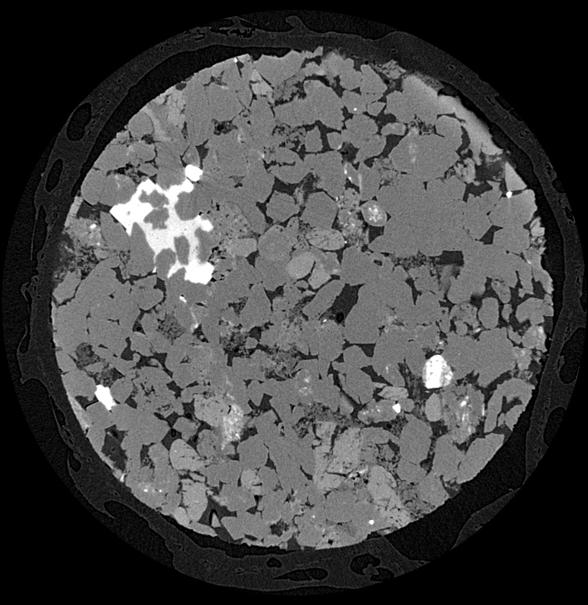
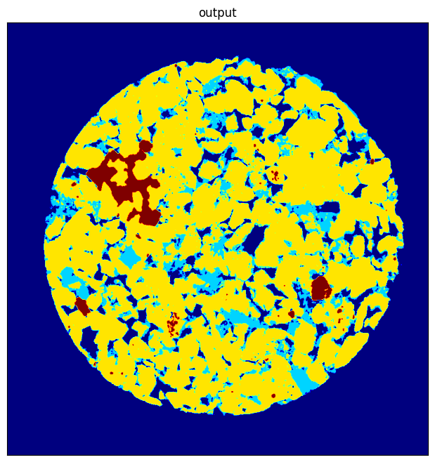

# Image segmentation in petrology

## Overview
- Trong công nghiệp, mỏ dầu khí là một trong những nguyên liệu quan trọng, và một trong những nguồn trích xuất là sa thạch (sandstone)
- Không phải sa thạch nào cũng có cấu trúc bên trong giống nhau, lượng dầu khí trích xuất được khác nhau
-> Cần tìm hiểu cấu trúc bên trong của sa thạch

## Bài toán
Phân tách các bức ảnh chụp cắt lớp thành 4 thành phần: Quặng pirit, Đá thạch anh, Đất sét, và còn lại là không khí

## Mô hình
Ảnh được đưa qua 1 lớp các filters và Gabor filter bank, rồi được chuyển thành các feature vectors và đưa vào mô hình Random Forest

## Dữ liệu
Dữ liệu đầu vào là 1 tif stack gồm 9 ảnh cắt lớp XRM:

Dữ liệu đầu ra là 1 ảnh segmented dưới dạng jet color map:

## Run
- Chạy lần lượt các cells trong file jupyter notebook
- Thay đổi thông số trong cell CONFIG